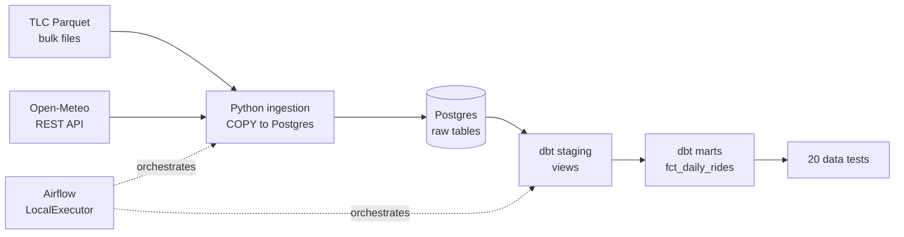

# NYC Rides & Weather Pipeline

An end-to-end ELT pipeline joining 12.7M NYC taxi trips to daily weather,
orchestrated with Airflow and modeled with dbt. Built to answer: does weather
change how much people ride, and how much they tip?

## Architecture



## Findings

Across January–April 2024 (12.66M trips, $349.7M in fares):

| Weather | Days | Avg daily trips | Avg tip | % trips tipped |
|---------|-----:|----------------:|--------:|---------------:|
| Heavy rain | 15 | 112,880 | $3.17 | 73.0% |
| Light rain | 41 | 109,906 | $3.30 | 74.1% |
| Dry | 53 | 100,532 | $3.41 | 75.8% |
| Snow | 12 | 90,746 | $3.39 | 77.7% |

Two observations:

1. **Ridership rises with rain but falls with snow.** Heavy rain days see ~12%
   more trips than dry days; snow days see ~10% fewer.
2. **Tipping moves the opposite way from volume.** Both average tip and the
   share of trips tipped decline as rain intensifies, while snow days show the
   highest tip rate of any condition.

**Caveat:** March and April carry ~20% more trips than January and February,
so any seasonal clustering of rain days partly confounds the volume result.
An earlier single-month (January) cut showed the *opposite* volume pattern —
a reminder that one month is not a sample.

## Stack

| Layer | Tool |
|-------|------|
| Ingestion | Python 3.12, pandas, pyarrow, psycopg2 |
| Storage | PostgreSQL 16 |
| Transformation | dbt 1.12 (dbt-postgres) |
| Orchestration | Airflow 3.1 (LocalExecutor) |
| Packaging | Docker Compose, uv |

## Quickstart

```bash
# 1. Start the warehouse
cp .env.example .env          # then edit credentials
docker network create data_net
docker compose up -d

# 2. Start Airflow
cd airflow
echo "AIRFLOW_UID=$(id -u)" > .env
docker compose build && docker compose up -d
```

Open http://localhost:8080 (airflow / airflow), unpause
`weather_rides_pipeline`, and trigger it with `{"month": "2024-01"}`.

To run ingestion without Airflow:

```bash
uv run python src/ingestion/load_trips.py --month 2024-01
uv run python src/ingestion/load_weather.py --month 2024-01
cd transform && DBT_PROFILES_DIR=. uv run --project .. dbt build
```

## Data quality

20 dbt tests run as part of every pipeline execution, gating the mart behind
the staging layer. Coverage includes uniqueness and not-null on grain columns,
accepted-value sets, and numeric range assertions via `dbt_utils`.

Two findings from the test suite worth noting:

- **`payment_type = 0`** appears in ~4% of 2024 trips but is absent from TLC's
  published data dictionary. Rather than filtering it, the value is retained
  and the test widened, with the anomaly documented in the model YAML.
- **17 trips per month carry pickup timestamps outside the file's own month**
  (including 2002 and 2009 dates in the 2024-01 file). These are meter or clock
  errors and are filtered in staging, with a singular test asserting the rule
  holds.

## Engineering decisions

**COPY over `pandas.to_sql`.** The initial load ran 2.5 minutes per month via
row-by-row INSERTs. Switching to Postgres `COPY ... FROM STDIN` with chunked
CSV buffers cut it to 48 seconds — a ~3x improvement — and sidestepped a
SQLAlchemy 1.4 / pandas 2.x incompatibility in the Airflow image.

**Idempotent loads in a single transaction.** Each month's load deletes its own
partition then inserts, both inside one transaction with explicit rollback.
An earlier version committed the delete separately; a mid-load failure wiped a
month of data with nothing to replace it.

**LocalExecutor over Celery.** Celery's worker adds a broker, a worker
container, and a failure surface that buys nothing on a single node. Local
execution keeps the stack to five containers.

**Mounted code over `DockerOperator`.** Airflow runs the project source from a
bind mount rather than triggering separate task containers. This trades
isolation for iteration speed — appropriate here, less so where tasks need
independent dependency sets.

## Known limitations

- The `month` DAG param has a default value, which prevents Airflow's native
  date-range backfill from taking effect (the param always wins over
  `data_interval_start`). Months are currently backfilled by triggering
  individual runs.
- The weather join is at daily grain, so intra-day weather variation is lost.
- Ridership figures are confounded by seasonality, as noted above.