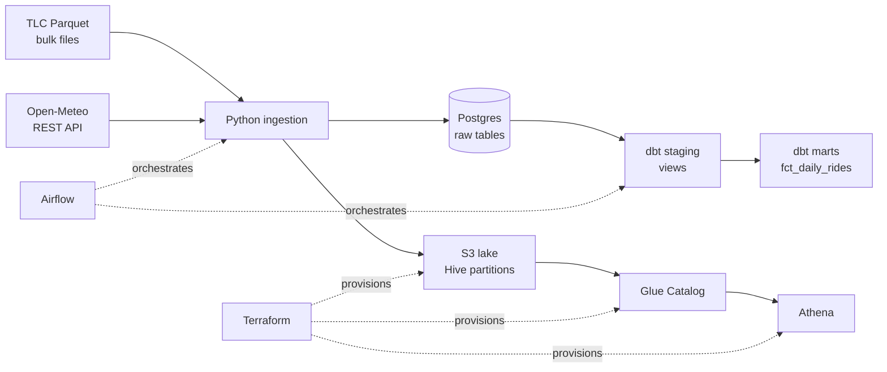

# NYC Rides & Weather Pipeline


An end-to-end data pipeline joining 12.7M NYC taxi trips to daily weather,
built twice: once as a local warehouse stack (Postgres + dbt + Airflow) and
once as a cloud lakehouse (S3 + Glue + Athena, provisioned with Terraform).

It answers a simple question — does weather change how much people ride, and
how much they tip? — and uses that question as a vehicle for the engineering
concerns that actually matter: idempotency, data quality testing, partition
design, query cost, and infrastructure as code.

## Architecture



Two ingestion patterns feed the pipeline: bulk Parquet file download for trip
data, and parameterised REST calls for weather. Both land in Postgres for
modelling and in S3 for lakehouse querying.

## Findings

Across January–April 2024 — **12,661,376 trips, $349.7M in fares**:

| Weather | Days | Avg daily trips | Avg tip | % trips tipped |
|---------|-----:|----------------:|--------:|---------------:|
| Heavy rain | 15 | 112,880 | $3.17 | 73.0% |
| Light rain | 41 | 109,906 | $3.30 | 74.1% |
| Dry | 53 | 100,532 | $3.41 | 75.8% |
| Snow | 12 | 90,746 | $3.39 | 77.7% |

**Ridership rises with rain but falls with snow.** Heavy rain days see ~12%
more trips than dry days; snow days see ~10% fewer. Rain appears to push
people from walking and transit into taxis, while snow suppresses travel
outright.

**Tipping moves opposite to volume.** Both the average tip and the share of
trips tipped decline as rain intensifies. Snow inverts this — the fewest trips
but the highest tip rate of any condition (77.7%).

**Caveat on the volume result.** March and April carry ~20% more trips than
January and February, so any seasonal clustering of rain days partly confounds
the comparison. An earlier single-month (January) cut showed the *opposite*
volume pattern, which is a useful reminder that one month is not a sample.

## Stack

| Layer | Tool |
|-------|------|
| Ingestion | Python 3.12, pandas, pyarrow, psycopg2, boto3 |
| Warehouse | PostgreSQL 16 |
| Transformation | dbt 1.12 (dbt-postgres), dbt_utils |
| Orchestration | Airflow 3.1 (LocalExecutor) |
| Lake | S3, Parquet + Snappy, Hive partitioning |
| Catalog & query | AWS Glue Data Catalog, Athena |
| Infrastructure | Terraform 1.9 |
| CI | GitHub Actions |
| Packaging | Docker Compose, uv |

## Results

**Pipeline runtime: 64 seconds** end to end for one month — parallel ingestion
(trips 48s, weather 5s) gated on a dbt build (14s) that runs 20 data tests
before publishing the mart.

**Load throughput: 2.5 min → 48s per month (~3x).** Replacing `pandas.to_sql`
with chunked Postgres `COPY ... FROM STDIN`.

**Query I/O: 56x reduction.** A single-month aggregate over the lake scans
4.16 MB against 243 MB of stored Parquet:

| Query | Data scanned |
|-------|-------------:|
| `WHERE year='2024' AND month='01'` | 4.16 MB |
| No partition filter | 17.82 MB |
| Raw stored size | 243 MB |

Partition pruning accounts for 4.3x (skipping three of four partitions);
Parquet's columnar layout accounts for a further 13x (reading one column
instead of ten). Since Athena bills per byte scanned, this ratio *is* the
cost difference.

## Data quality

20 dbt tests run as part of every pipeline execution, gating the mart behind
the staging layer — `dbt build` interleaves models and tests so bad data is
caught before it propagates downstream. Coverage includes uniqueness and
not-null on grain columns, accepted-value sets, and numeric range assertions
via `dbt_utils`, plus a singular test for a business rule.

Two findings the suite surfaced:

**`payment_type = 0`** appears in ~4% of 2024 trips but is absent from TLC's
published data dictionary. At that volume it is clearly an operational
category rather than corruption, so the value is retained, the test widened,
and the anomaly documented in the model YAML. Filtering it would have silently
dropped 500k+ trips.

**17 trips per month carry pickup timestamps outside the file's own month**,
including 2002 and 2009 dates in the 2024-01 file. These are meter or clock
errors. They are filtered in the staging layer, with a singular test asserting
the rule holds.

## Engineering decisions

**COPY over `pandas.to_sql`.** Beyond the 3x speedup, this sidestepped a
SQLAlchemy 1.4 / pandas 2.x incompatibility in the Airflow image, where
`to_sql` rejects both `Engine` and `Connection` objects. Fixing it in code
rather than by pinning versions avoided fighting the base image's own
dependency tree.

**Idempotent loads in a single transaction.** Each month's load deletes its
own partition then inserts, both inside one transaction with explicit
rollback. An earlier version committed the delete separately; a mid-load
failure wiped a month of data with nothing to replace it. Reruns now produce
identical row counts, and failures leave the table untouched.

**Declared Glue schema, not a crawler.** Crawlers infer schema by sampling,
cost money per run, and can silently change a table definition. Declaring
columns and partition keys in Terraform keeps the schema version-controlled
and reviewable.

**Raw layer fidelity.** Both the Postgres and S3 paths store the source data
unfiltered, with cleaning rules applied in the transformation layer. An
earlier version filtered during S3 ingestion, which made Athena and Postgres
row counts disagree by exactly 17 rows — the out-of-month records. Reconciling
this means the two systems now agree exactly at every grain.

**LocalExecutor over Celery.** A broker and worker container buy nothing on a
single node and add a failure surface. This keeps the Airflow stack to five
containers.

**Cost guardrails before resources.** A zero-spend budget, billing alerts, an
Athena workgroup with a 1 GB `bytes_scanned_cutoff_per_query`, and a lifecycle
rule expiring query results after 7 days — all in place before the first
bucket was created. The scan cap is enforced by AWS, so a runaway query is
killed rather than billed.

## Quickstart

```bash
# 1. Warehouse
cp .env.example .env          # then edit credentials
docker network create data_net
docker compose up -d

# 2. Airflow
cd airflow
echo "AIRFLOW_UID=$(id -u)" > .env
docker compose build && docker compose up -d
```

Open <http://localhost:8080> (`airflow` / `airflow`), unpause
`weather_rides_pipeline`, and trigger it with `{"month": "2024-01"}`.

Running the stages directly, without Airflow:

```bash
uv run python src/ingestion/load_trips.py --month 2024-01
uv run python src/ingestion/load_weather.py --month 2024-01
cd transform && DBT_PROFILES_DIR=. uv run --project .. dbt build
```

Provisioning the cloud side:

```bash
cd infra
terraform init
terraform plan          # always read the plan before applying
terraform apply
```

Then publish to the lake and register partitions:

```bash
uv run python src/ingestion/load_to_s3.py --month 2024-01
aws athena start-query-execution \
  --query-string "MSCK REPAIR TABLE trips" \
  --query-execution-context Database=weather_rides_lake \
  --work-group weather-rides
```

## Scheduling

The DAG runs `@monthly`. TLC publishes trip data on roughly a two-month lag,
so a scheduled run covering month M ingests the file for M−2:

```python
MONTH = "{{ params.month or (data_interval_start -
          macros.dateutil.relativedelta.relativedelta(months=2))
          .strftime('%Y-%m') }}"
```

An explicit `month` parameter overrides this for backfills and re-runs. The
parameter is declared with a typed `Param` carrying a `^\d{4}-\d{2}$` pattern,
so a malformed month is rejected at trigger time rather than failing three
minutes into a download.

## CI

Every push runs three parallel jobs:

- **Terraform** — `fmt -check`, `init -backend=false`, `validate`
- **Python** — `ruff check` and `ruff format --check`
- **dbt** — `deps`, `parse`, and `compile` against a Postgres service container

## Known limitations

- The weather join is at daily grain, so intra-day variation is lost. Hourly
  weather would let trips be attributed to the conditions at pickup time.
- Ridership figures are confounded by seasonality, as noted above. A longer
  window or a seasonal control would separate the two effects.
- The IAM user currently holds AWS-managed full-access policies for S3, Glue,
  and Athena. A least-privilege policy scoped to this bucket and database is
  the correct end state.
- Scheduled runs assume the upstream file exists. A production version would
  add an availability sensor rather than failing on a 404.
- Terraform state is local. A remote backend with state locking would be
  required for any multi-person use.
